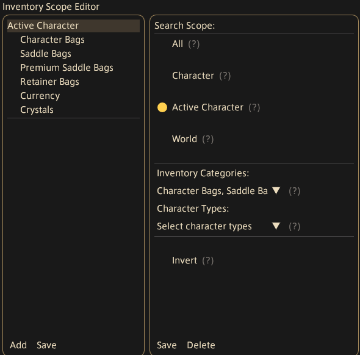

# How to use the inventory scope picker

The inventory scope picker lets you define which inventories are searched by a particular feature. With no scopes defined, every inventory Allagan Tools knows about is searched. Each scope you add narrows that down to a specific character, world, or set of inventory categories.

{ width="250" }

## The scope list (left panel)

Lists all defined scopes. Each entry shows the scope name with its configured inventory categories and character types indented beneath it. Click a scope to select and edit it on the right.

- **Add** — creates a new blank scope and opens it for editing
- **Save** — closes the picker

## Configuring a scope (right panel)

### Search Scope

Mutually exclusive radio buttons that set what the scope targets:

| Option | Searches |
|---|---|
| **All** | Every inventory Allagan Tools knows about |
| **Character** | A specific character selected from a dropdown (grouped by type: player, retainer, free company, etc.) |
| **Active Character** | Whoever is currently logged in, including their retainers, free companies, etc. |
| **World** | All characters on a specific world, selected from a dropdown |

### Inventory Categories

Multi-select dropdown. When set, only the chosen categories are included in the scope — leave it empty to include all categories. When **Character** mode is selected, the list is filtered to categories applicable to that character's type.

### Character Types

Multi-select dropdown, available when Search Scope is **All**, **Active Character**, or **World**. Restricts the scope to only the chosen character types (e.g. Player, Retainer, Free Company). Not shown when targeting a specific character.

### Invert

When checked, the scope matches the *opposite* of what is configured. The scope name gains an *(Invert)* suffix in the list. Useful for excluding a specific character or category from an otherwise broad search.

### Save / Delete

**Save** confirms edits and deselects the scope. **Delete** removes the scope from the list entirely.
