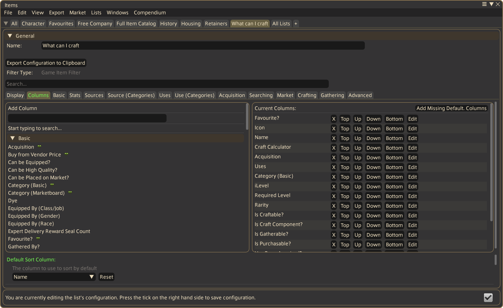

# What Can I Craft?

This guide uses a preset list to show how many of each craftable item you can make using materials already in your inventories.

## Setup

1. Download the [share code](what-can-i-craft.txt).
2. In Allagan Tools, open **Lists** → **Import/Export** → **Import List (Share Code)**.
3. Paste the share code and click **OK**. A list named **"What can I craft"** will appear.

## Calculating crafts

1. Switch to the **What can I craft** tab.
2. Click **Calculate Crafts** at the bottom of the window. This simulates crafting every craftable item in the game against your inventories — wait for the button to return to its normal state before proceeding.
3. Click the **Craft Calculator** column header (4th column) to sort by the results.

The count shown is how many of each item you can craft right now, based on materials in your active character's bags, saddlebags, retainer bags, currency, and crystals.

## Changing which inventories are searched

The inventories the Craft Calculator considers can be adjusted through the column's settings. See [How to use the inventory scope picker](inventory-scope-picker.md) for a full explanation of scopes.

1. On the list screen, click the **pencil icon** in the top-right of the window to enter edit mode.
2. Go to the **Columns** tab.

    { width="420" }

3. On the right-hand side, find **Craft Calculator** and click **Edit**.
4. The column's edit screen appears on the left. Find the **Inventories to search in** field and click its pencil icon to open the Inventory Scope picker.
5. The left side lists the active scopes — by default there is one entry, **Active Character**, meaning all calculations are scoped to your currently active character. Click it to open its configuration.
6. Use the **Inventory Categories** dropdown on the right to add or remove the categories considered when calculating craft numbers.