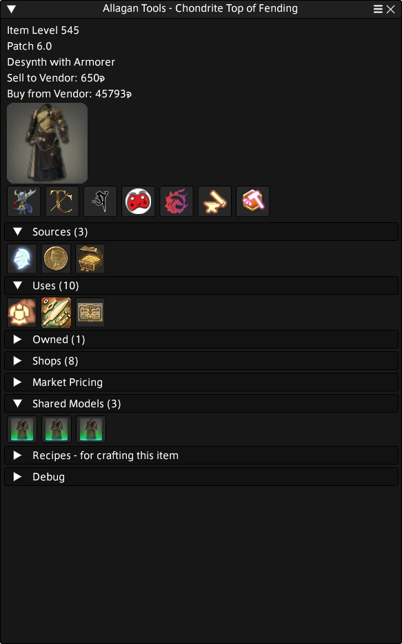
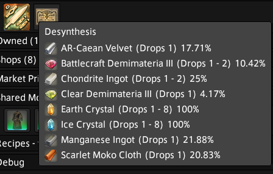
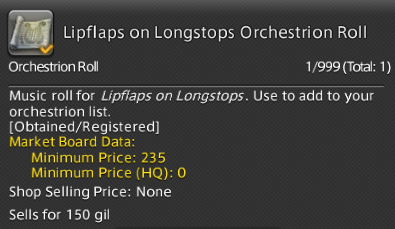
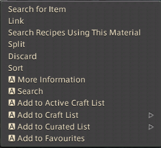

# Showcase

Allagan Tools is a dalamud plugin for Final Fantasy XIV that focuses on inventory tracking, crafting support, and detailed item data. This page showcases it's main features.

---

## Item Tracking

{ align=right width="420" }

Item Tracking scans and caches inventory data across your characters. It provides a consolidated view of what you own and where each item is stored.

Track items across:

- Character inventories and bags
- Chocobo saddlebags
- Armory chest
- Retainers
- Glamour dresser
- Armoire
- Free Company chest
- Housing

All items are searchable and grouped by location.

---

## Craft Lists

{ align=left width="420" }

Craft Lists uses your tracked inventory and item data to help plan crafting.

View:

- Materials currently owned
- Missing components
- Acquisition sources
- Required quantities

The interface updates automatically as inventory data changes.

---

## Item Information

{ align=right width="200" }
{ align=right width="195" }

The Item Information window displays extended details about an item, combining in-game data with additional references.

Includes:

- Stats
- Sources/Uses
- Item Locations
- Shared Models
- Marketboard data
- Recipes

---

## Source / Use Information

{ align=right width="260" }
{ align=right width="260" }

Most items include source and use data.

Examples:

- Craft recipes
- Shops
- Gathering
- Ventures
- Dungeons
- Achievements
- PVP
- Coffers
- And much much more

This information is integrated directly into the item view and item lists

---

## Tooltips

{ width="260" align=right }
{ width="260" align=right }
{ width="260" align=right }
{ width="260" align=right }
{ width="260" align=right }

Allagan Tools can extend item tooltips with additional overlays.

Additions may include:

- Storage locations
- Market pricing (via Universalis)
- Acquisition status across characters
- Source and usage details
- Patch information

---

## Context Menu

{ align=left width="250" }

The plugin can add extra options to the right-click context menu.

Available actions:

- Open the Item Information window
- Add items to Craft Lists

---

## Equipment Recommendations

- 
- 

Equipment Recommendations suggests gear based on selected criteria.

Choose:

- Level + Class / Job
- Tool/Weapon

The tool lists items that can be equipped at that level, helping identify upgrades or missing pieces. Suggested items can be sent directly to Craft Lists.

---

## Compendium *(Coming Soon)*

- 
- 

The Compendium is planned as a broader reference section covering:

- Quests
- NPCs
- Monsters
- Leves
- Gearsets
- Additional game systems

More details will be added in a future release.

---
